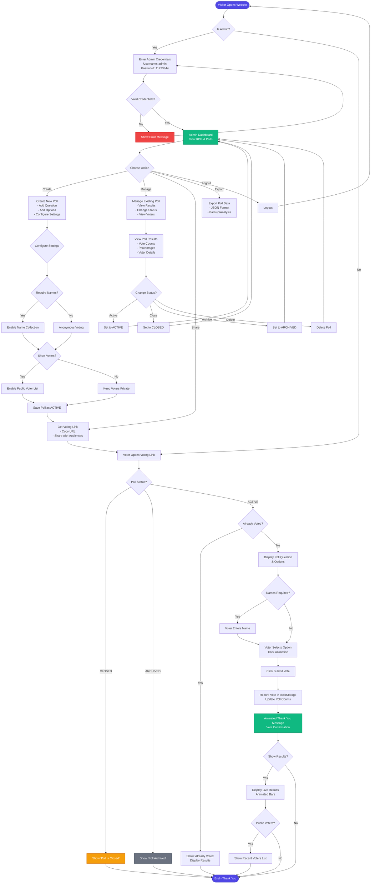

# 🗳️ FindasAcademy Polling System - Owner's Guide

**Date:** February 26, 2026  
**System:** Admin Polls Web Application  
**Website:** https://findasacademy.in/polls

---

## 🌐 About Your Polling System

Your custom polling system is now live at **https://findasacademy.in/polls**. This single-page application allows you to:
- Create unlimited polls with multiple options
- Share voting links with your community
- Track results in real-time
- Manage voter data and privacy settings
- Export poll data for analysis

The system features a modern glassmorphism design with smooth animations and works perfectly on all devices.

### Quick Access Links:
- 🏠 **Admin Dashboard:** https://findasacademy.in/polls
- 🗳️ **Voting Page Example:** https://findasacademy.in/polls#/vote/[poll-id]

---

## 🔐 Admin Login Credentials

**Access URL:** https://findasacademy.in/polls

```
Username: admin
Password: 11223344
```

> ⚠️ **Important:** Please change these credentials after first login by updating the password hash in the system settings.

---

## 📋 Quick Start Guide

### Step 1: Access Admin Panel
1. Open https://findasacademy.in/polls in your web browser
2. You'll see the login screen with the FindasAcademy logo
3. Enter the credentials provided above
4. Click **Login**

### Step 2: Create Your First Poll
1. Once logged in, you'll see the dashboard with KPIs
2. Click the **"Create New Poll"** button
3. Fill in the poll details:
   - **Question:** Your poll question
   - **Options:** Add multiple choice options (minimum 2)
   - **Settings:**
     - ✅ Require voter names (optional)
     - ✅ Show voters publicly (optional)
4. Click **Create Poll**

### Step 3: Share Poll with Voters
1. After creating the poll, you'll see a **"Get Voting Link"** button
2. Click it to copy the unique voting URL
3. The voting link format: `https://findasacademy.in/polls#/vote/[unique-poll-id]`
4. Share this link via:
   - WhatsApp
   - Email
   - Social Media
   - SMS
   - QR Code

### Step 4: Monitor Results
1. View live results in the admin dashboard
2. See vote counts and percentages
3. View voter lists (if enabled)
4. Export results as needed

---

## 🎯 System Features

### For Admins:
- ✅ Create unlimited polls
- ✅ Real-time vote tracking
- ✅ Manage poll status (Active/Closed/Archived)
- ✅ View detailed voter information
- ✅ Export/Import poll data
- ✅ Toggle voter name requirements
- ✅ Control public voter visibility
- ✅ Search and filter voters

### For Voters:
- ✅ One-tap voting experience
- ✅ Anonymous or named voting
- ✅ Duplicate vote prevention
- ✅ Instant feedback with animations
- ✅ Thank you message after voting
- ✅ Mobile-optimized interface
- ✅ Glassmorphism modern design

---

## 📊 System Flow Diagram



---

## 🔄 Poll Status Management

| Status | Description | Voter Access | Admin Actions |
|--------|-------------|--------------|---------------|
| **ACTIVE** | Poll is open for voting | ✅ Can vote | View results, Change status |
| **CLOSED** | Poll closed, no new votes | ❌ Cannot vote | Reopen, Archive, Delete |
| **ARCHIVED** | Poll archived for records | ❌ Cannot vote | Restore, Delete |

---

## 💾 Data Storage

**Storage Method:** Browser localStorage  
**Data Persistence:** Until browser cache is cleared  
**Backup:** Export polls regularly as JSON

### Backup Instructions:
1. Go to Admin Dashboard
2. Find the poll you want to backup
3. Click **"Export Poll"**
4. Save the JSON file to your computer
5. To restore: Click **"Import Polls"** and select the JSON file

---

## 🎨 Design Features

- **Glassmorphism UI:** Modern translucent cards with backdrop blur
- **Atmospheric Background:** Gradient mesh with grain texture
- **Smooth Animations:** Ripple effects, shimmer bars, fade-in transitions
- **Responsive Design:** Works perfectly on desktop, tablet, and mobile
- **Accessibility:** Keyboard navigation and screen reader friendly

---

## 🛠️ Poll Management Tips

### Creating Effective Polls:
1. **Keep questions clear and concise**
2. **Limit options to 4-6 choices**
3. **Use descriptive option labels**
4. **Test the poll before sharing widely**

### Best Practices:
- ✅ Close polls after deadline
- ✅ Archive old polls to keep dashboard clean
- ✅ Export important poll data regularly
- ✅ Use name requirement for accountability when needed
- ✅ Enable public voters for transparency (events, surveys)
- ✅ Keep voter names private for sensitive topics

### Voter Engagement:
- Share voting links through multiple channels
- Set clear deadlines
- Send reminders before poll closes
- Share results after closing (if appropriate)

---

## 🔒 Security Features

1. **SHA-256 Password Hashing:** Admin password is securely hashed
2. **Duplicate Vote Prevention:** localStorage-based duplicate detection
3. **Session Management:** Auto-logout on browser close
4. **Data Encryption:** Sensitive data stored securely

---

## 📱 Sharing Options

### Share Voting Links Via:

**WhatsApp:** 
```
Hey! Vote in our poll: https://findasacademy.in/polls#/vote/[poll-id]
Your opinion matters! Takes just 5 seconds.
```

**Email:**
```
Subject: Your Vote Needed - FindasAcademy Poll

Hi there,

We'd love to hear your opinion! Please take a moment to vote in our quick poll:

https://findasacademy.in/polls#/vote/[poll-id]

Thank you for your participation!

Best regards,
FindasAcademy Team
```

**Social Media:**
```
🗳️ Quick poll time! Let us know what you think:
https://findasacademy.in/polls#/vote/[poll-id]
#FindasAcademy #CommunityVote
```

---

## 🆘 Troubleshooting

### Issue: Can't login
**Solution:** Verify credentials are exactly: `admin` / `11223344`

### Issue: Voting link not working
**Solution:** Ensure poll status is ACTIVE, not CLOSED or ARCHIVED

### Issue: Duplicate vote message
**Solution:** This is by design. Each device can vote once per poll.

### Issue: Data disappeared
**Solution:** Check browser localStorage. Use Export/Import for backups.

### Issue: Mobile display issues
**Solution:** The system is fully responsive. Try refreshing the page.

---

## 📞 Support Contact

**FindasAcademy Support**  
Email: support@findasacademy.in  
Website: https://findasacademy.in

---

## 🚀 Advanced Features

### Import/Export Functionality:
- Export single polls or all polls
- JSON format for easy backup
- Import feature for data migration

### Bulk Operations:
- Archive multiple old polls at once
- Export all polls for reporting

### Analytics:
- View total polls created
- Track total votes received
- Monitor active polls count
- See average votes per poll

---

## 📈 Success Metrics

Track these KPIs on your dashboard:
- **Total Polls Created**
- **Total Votes Received**
- **Active Polls Count**
- **Average Votes Per Poll**
- **Voter Engagement Rate**

---

## ✅ Getting Started Checklist

- [ ] Login to admin panel
- [ ] Create your first test poll
- [ ] Vote on the test poll (open in incognito/different browser)
- [ ] View results in admin dashboard
- [ ] Export poll data for backup
- [ ] Create your first real poll
- [ ] Share voting link
- [ ] Monitor results
- [ ] Close poll when complete
- [ ] Archive after analysis

---

**Welcome to your new polling system!** 🎉

For any questions or assistance, please don't hesitate to reach out to the development team.

---

*Document Version: 1.0*  
*Last Updated: February 26, 2026*  
*System: https://findasacademy.in/polls*

---

<div align="center">
  <a href="https://dcoresystems.com" target="_blank">
    
  </a>
  <p><strong>Created by <a href="https://dcoresystems.com" target="_blank">Dcore Systems LLP</a></strong></p>
  <p><em>Building innovative web solutions for modern businesses</em></p>
</div>
